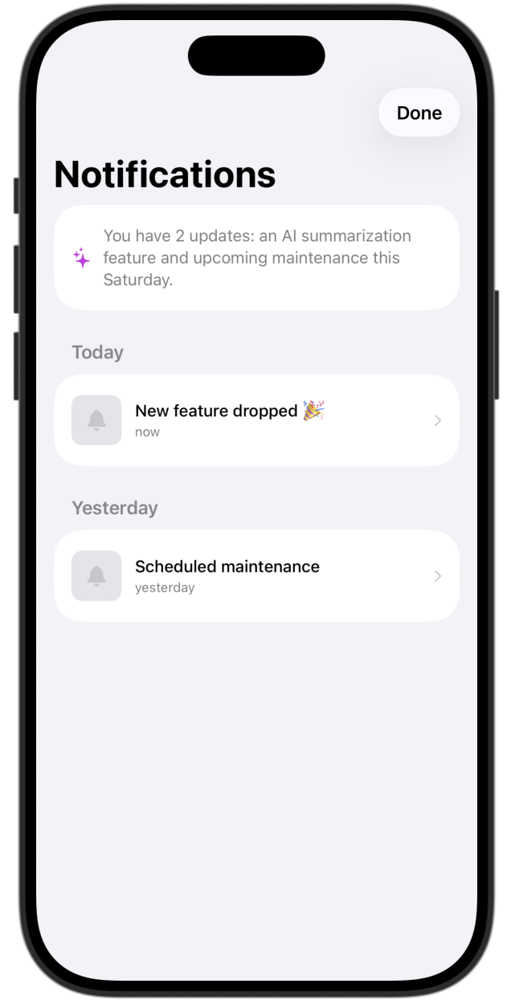
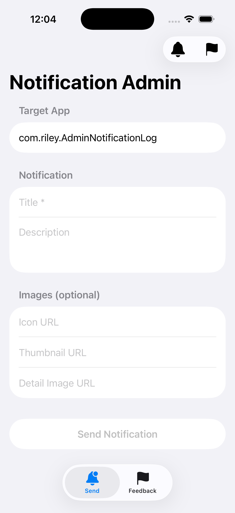
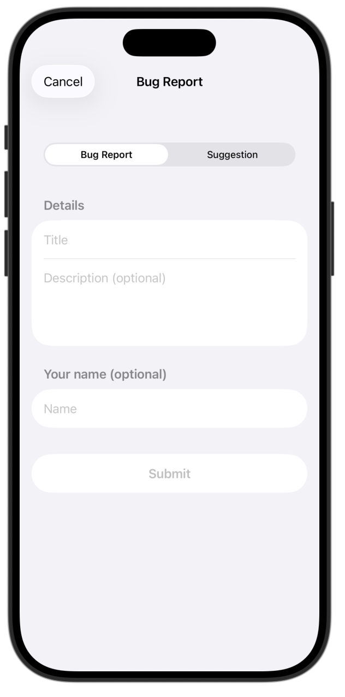
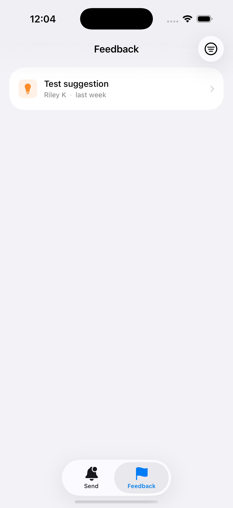

# NotificationLog

A zero-dependency Swift package that adds a notification log sheet to any SwiftUI app. Fetches notifications from Supabase by `appID`, auto-shows the sheet on new entries, tracks read state locally, and includes a badge button — all in one `.notificationLog(config:)` modifier.

Also includes a built-in feedback system for bug reports and suggestions, and an on-device AI summary of unread notifications powered by Apple Intelligence (iOS 26+, where available).

---

## Screenshots

| Notification Log | Notification Detail | Feedback Sheet |
|:---:|:---:|:---:|
|  |  |  |

| Admin — Send | Admin — Feedback |
|:---:|:---:|
|  |  |

---

## Setup

### 1. Add the package

In Xcode: **File → Add Package Dependencies** → paste your repo URL.

Or in `Package.swift`:
```swift
.package(url: "https://github.com/you/NotificationLog", from: "1.0.0")
```

### 2. Create the Supabase tables

Run `supabase_schema.sql` in your Supabase Dashboard → SQL Editor. This creates both the `notifications` and `feedback` tables.

### 3. Attach the modifier

```swift
import NotificationLog

@main
struct MyApp: App {
    var body: some Scene {
        WindowGroup {
            ContentView()
                .notificationLog(config: NotificationLogConfig(
                    supabaseURL: "https://xxx.supabase.co",
                    supabaseAnonKey: "your-anon-key",
                    appID: "com.example.myapp"
                ))
        }
    }
}
```

That's it. The sheet auto-appears when new notifications arrive.

---

## Buttons

Both buttons work anywhere in the view hierarchy below `.notificationLog(config:)` — no extra config needed.

```swift
// Bell icon — opens the notification log with unread badge
NotificationLogButton()

// Flag icon — opens a bug report / suggestion form
FeedbackButton()
```

```swift
// Typical toolbar usage
.toolbar {
    ToolbarItem(placement: .navigationBarTrailing) {
        NotificationLogButton()
    }
    ToolbarItem(placement: .navigationBarTrailing) {
        FeedbackButton()
    }
}
```

---

## Configuration

```swift
NotificationLogConfig(
    supabaseURL:     "https://xxx.supabase.co",  // required
    supabaseAnonKey: "eyJ...",                   // required (anon key for reads)
    appID:           "com.example.myapp",         // required — filters by this
    pollInterval:    60,                          // seconds, nil = no polling
    tableName:       "notifications"              // override if needed
)
```

---

## AI Summary

When Apple Intelligence is available on the user's device (iOS 26+), the notification log automatically shows a one-sentence summary of unread notifications at the top of the sheet — powered by the on-device `FoundationModels` framework. No API key required, nothing leaves the device.

On devices without Apple Intelligence enabled the summary is silently skipped — no UI change, no errors.

---

## Manual control

Access the ViewModel anywhere below the `.notificationLog` modifier:

```swift
@Environment(\.notificationLogViewModel) private var notifVM

// Show the log programmatically
Button("Updates") { notifVM?.showLog() }

// Check unread count
Text("\(notifVM?.unread.count ?? 0) unread")

// Manual refresh
await notifVM?.refresh()
```

---

## Posting notifications (Admin / Companion App)

Use `NotificationLogService` with your **service role key** (never ship in client apps):

```swift
let service = NotificationLogService(config: NotificationLogConfig(
    supabaseURL: "https://xxx.supabase.co",
    supabaseAnonKey: "YOUR_SERVICE_ROLE_KEY",
    appID: "com.example.myapp"
))

try await service.postNotification(NewNotificationPayload(
    appID: "com.example.myapp",
    title: "New feature dropped 🎉",
    icon: "https://example.com/icon.png",
    details: NotificationDetails(
        description: "We just shipped dark mode. Check it out!",
        imageURL: "https://example.com/darkmode-hero.png"
    )
))
```

---

## Reading feedback (Admin / Companion App)

Use `FeedbackService` with your **service role key** to fetch submitted feedback:

```swift
let service = FeedbackService(config: NotificationLogConfig(
    supabaseURL: "https://xxx.supabase.co",
    supabaseAnonKey: "YOUR_SERVICE_ROLE_KEY",
    appID: "com.example.myapp"
))

let feedback = try await service.fetchFeedback(for: "com.example.myapp")
```

---

## Schema reference

### notifications
| Column | Type | Notes |
|--------|------|-------|
| `notification_id` | `uuid` | PK, auto-generated |
| `app_id` | `text` | Filters per-app |
| `title` | `text` | Shown in list + detail header |
| `icon` | `text?` | URL, shown as app icon |
| `thumbnail` | `text?` | URL, shown in list row |
| `date_added` | `timestamptz` | Defaults to `now()` |
| `details` | `jsonb?` | `{ description, image_url }` |

### feedback
| Column | Type | Notes |
|--------|------|-------|
| `feedback_id` | `uuid` | PK, auto-generated |
| `app_id` | `text` | Filters per-app |
| `type` | `text` | `bug` or `suggestion` |
| `title` | `text` | Short summary from user |
| `description` | `text?` | Full detail |
| `sender_name` | `text?` | Optional, filterable in admin |
| `app_version` | `text?` | Auto-captured |
| `device_info` | `text?` | Auto-captured |
| `date_added` | `timestamptz` | Defaults to `now()` |

---

## Supabase RLS

**notifications**
- Public read — anon key can SELECT
- Service insert — only service_role key can INSERT

**feedback**
- Public insert — anyone can submit feedback
- Service read — only service_role key can SELECT (keep feedback private to you)
